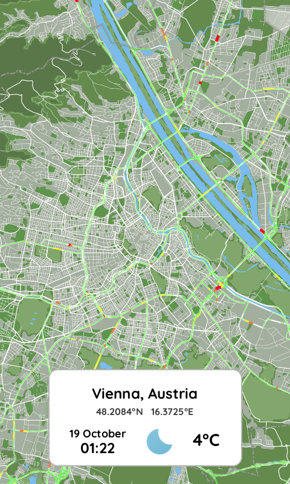

# Smart City Maps

The Smart Dashboard System creates beautiful, location-based maps with real time traffic and weather information and displays them on 7.3" e-paper displays. The system is designed for autonomous operation with minimal power consumption through intelligent deep sleep management.

The system consists of a **Python server** for map generation running on Github's actions regularly and an **ESP32-S2-based firmware** that fetches the generated map and displays it on your 7-color e-paper.

### 🏗️ Architecture

```
Smart Dashboard System
├── 🐍 Server/                      # Python Map Generation
│   ├── Map generation with Mapbox styles (allowing live traffic)
│   ├── Real-time weather information (through Open Weather API)
│   └── E-paper format conversion (and rendering)
│
└── ⚡ Firmware/                    # ESP32-S2 Display Control
    ├── Autonomous image fetching
    ├── Deep sleep power management
    └── Battery monitoring
```

## 🖼️ Generated Output Examples

The system generates multiple formats for each location:

<table>
<tr>
<td align="center"><strong>Original PNG Output</strong><br/><sub>Vienna_Austria.png (480x800px)</sub></td>
<td align="center"><strong>E-Paper Display Preview</strong><br/><sub>Vienna_Austria_epd.png (480x800px)</sub></td>
</tr>
<tr>
<td></td>
<td></td>
</tr>
</table>

### Generated Files Per Location
- **`.png`** - High-quality original map (480x800px)
- **`.bin`** - Binary format for ESP32 consumption (192KB)
- **`_epd.png`** - E-paper preview showing actual display appearance


## 🚀 Getting Started

1. **Choose your setup**: Server-only for map generation, or complete system with hardware
2. **Follow component READMEs**: Detailed instructions in `Server/` and `Firmware/` directories  
3. **Configure APIs**: Get free API keys from required services
4. **Generate your first map**: Run the server component for your location and set your Github actions to generate your map regularly.
5. **Deploy to device**: Upload firmware.


## Hardware Setup

**Electronics:**
- [Smart Dashboard](https://smart-dashboard.readthedocs.io)
- 7.3" E-paper display (800x480, 7-color). Tested displays:
   - [Seed-studio](https://www.seeedstudio.com/7-3-Seven-Color-ePaper-Display-with-800x480-Pixels-p-5787.html)
   - [Waveshare](https://www.waveshare.com/7.3inch-e-Paper-F.htm)
   - [Good Display](https://www.good-display.com/product/442.html)
- Optional: LiPo battery


**Frame:**

For the frame you can use an off-the-shelf photo frame, like IKEA's [LOMVIKEN 13x18cm](https://www.ikea.com/at/en/p/lomviken-frame-black-70518202) with some modifications to keep the electronics in place. Alternativelly, you can 3d-print this  rounded enclosure:
- [Front](Enclosure/Front.stl)
- [Rear](Enclosure/Rear.stl)
- [Holder](Enclosure/Holder.stl) 

<table>
<tr>
<td align="center"><strong>Black enclosure</strong><br/></td>
<td align="center"><strong>White enclosure</strong><br/></td>
</tr>
<tr>
<td></td>
<td></td>
</tr>
</table>

## 📄 License & Credits

### Weather Icons
Weather icons are based on [Weather Icons](https://github.com/basmilius/weather-icons) by [@basmilius](https://github.com/basmilius), modified for e-paper display compatibility.

### E-paper Driver
Based on Seed studio e-paper display libraries, adapted for Smart Dashboard requirements.

### Dependencies
- **Server**: Requests, Pillow, NumPy, PyTZ, GeoPy
- **Firmware**: ArduinoJson, ESP32 WiFi, PlatformIO
- **APIs**: Mapbox, OpenWeatherMap, Geonames
